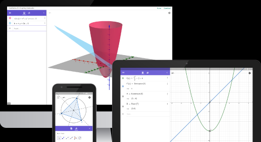

[toc]
# Hello ,world
```
# 一级标题
## 二级标题
### 三级标题


---
分割线


```

---

```
**重点加粗**
```
**重点加粗**

*斜体*

~~删除线~~

---

## 列表：
* 无序列表
  * 嵌套无序列表
  * 嵌套无序列表
  
1. 有序列表1
   1. 嵌套有序列表1
   2. 嵌套有序列表2
2. 有序列表2
3. 有序列表3
   
---

## 引用文本：
>引用别人说的话
就这样写
By.OrangeX4

---


## 这是`行内代码`语法

代码块语法：
```python
print("hello,world")

```
---
## 链接

[超链接名称](链接地址)

[小黄站](https://www.luogu.com.cn/)

[OrangeX4's Blog](https://orangex4.cool/)


---
## 表格：
| 表头 | 表头 |
| ---- | ---  |
| 内容| 内容|
|内容|内容|

==拓展语法：== 不可用
---
|表头|表头|
|---|---|
|内容|内容|
| > |内容|
| 表头 | 表头 |
| ---- | ---- |
| 内容 | 内容 |
|  >    | 内容 |

| 表头 | 表头 |
| ---- | ---- |
| 内容 | 内容 |
|  ^   | 内容 | 


---
##注释：
<!--你看不见我-->

##高亮
==高亮==

---


##任务列表：
- [x] 已经完成的事 1
- [x] 已经完成的事 2
- [x] 已经完成的事 3
- [ ] 仍未完成的事 4
- [ ] 仍未完成的事 5
  
---
##代码行数的显示：
```javascript{.line-numbers}
function add (x,y){
        return x+y

}
```
---
# 数学公式支持
## 特殊字符


## 行内公式：
单位圆 $x^2+y^2=1$
## 公式块：
$$
\begin{cases}
x=\rho\cos\theta \\
y=\rho\sin\theta \\
\end{cases}
$$
不要在公式内使用中文，除非是`\text{你好}`
$\text{你好}$

---
### 1. 上标和下标
上标 $x^2 + y^{12} = 1$
上标 $x_1 + y_{12} = 1$
HyperSnips 自动扩展：
$xsr  =>  x^{2}$
$xtp  =>  x^{...}$
$x1  =>  x_1$
$xii  =>  x_i$
$xsb  =>  x_{...}$

### 2. 分式
较小的行内行分数 $\frac{1}{2}$
展示型的分式 $\displaystyle\frac{x+1}{x-1}$

### 3. 根式
开平方 $\sqrt{2}$
开 $n$ 次方 $\sqrt[n]{2}$

### 4. 空格
数学公式中的 空格和换行 都会在编译时 被忽略，想要实现「空格」的效果，需要用特别的命令。
紧贴 $a\!b$
没有空格 $ab$
小空格 $a\,b$
中等空格 $a\;b$
大空格 $a\ b$
quad 空格 $a\quad b$
两个 quad 空格 $a\qquad b$

### 5.累计 
累加 $\sum_{k=1}^n\frac{1}{k}  \quad  \displaystyle\sum_{k=1}^n\frac{1}{k}$
累乘 $\prod_{k=1}^n\frac{1}{k}  \quad  \displaystyle\prod_{k=1}^n\frac{1}{k}$
积分 $\displaystyle \int_0^1x{\rm d}x  \quad  \iint_{D_{xy}}  \quad  \iiint_{\Omega_{xyz}}$

### 6. 括号修饰
用 \left 和 \right 可以让括号适配内部大小
圆括号 $\displaystyle \left(\sum_{k=1}^{n}\frac{1}{k} \right)^2$
方括号 $\displaystyle \left[\sum_{k=1}^{n}\frac{1}{k} \right]^2$
花括号 $\displaystyle \left\{\sum_{k=1}^{n}\frac{1}{k} \right\}^2$
尖括号 $\displaystyle \left\langle\sum_{k=1}^{n}\frac{1}{k} \right\rangle^2$

### 7. 多行算式对齐
居中:
$$
\begin{aligned}
y &=(x+5)^2-(x+1)^2 \\
&=(x^2+10x+25)-(x^2+2x+1) \\
&=8x+24 \\
\end{aligned}
$$
左对齐:
$
\begin{aligned}
y &=(x+5)^2-(x+1)^2 \\
&=(x^2+10x+25)-(x^2+2x+1) \\
&=8x+24 \\
\end{aligned}
$

### 8. 方程组
$$
\begin{cases}
k_{11}x_1+k_{12}x_2+\cdots+k_{1n}x_n=b_1 \\
k_{21}x_1+k_{22}x_2+\cdots+k_{2n}x_n=b_2 \\
\cdots \\
k_{n1}x_1+k_{n2}x_2+\cdots+k_{nn}x_n=b_n \\
\end{cases}
$$
### 9. 矩阵
矩阵:
$$
\begin{pmatrix}
1 & 1 & \cdots & 1 \\
1 & 1 & \cdots & 1 \\
\vdots & \vdots & \ddots & \vdots \\
1 & 1 & \cdots & 1 \\
\end{pmatrix}
$$
$$
\quad
\begin{bmatrix}
1 & 1 & \cdots & 1 \\
1 & 1 & \cdots & 1 \\
\vdots & \vdots & \ddots & \vdots \\
1 & 1 & \cdots & 1 \\
\end{bmatrix}
$$ 
行列式: 

$$
\begin{vmatrix}
1 & 1 & \cdots & 1 \\
1 & 1 & \cdots & 1 \\
\vdots & \vdots & \ddots & \vdots \\
1 & 1 & \cdots & 1 \\
\end{vmatrix}
$$
### 10. 特殊字符
    
### 11. 公式编号与引用
$$
x+2 \tag{1.2}
$$

$$
\begin{equation}
x^n+y^n=z^n
\end{equation}
$$
由公式 $(1.2)$ 可得到结论

# 进阶
## 自动目录
只需要使用语法
[TOC] 

就能自动生成目录.
##画图
###1.流程图

###2.时序图


### 3.函数三维图
[GeoGebra 官网](https://www.geogebra.org/)
