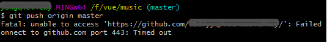

解决方案：
```
git config --global --unset http.proxy
git remote rm origin  //之前git上传地址报错，删除一下
git config --global -l //查看git当前设置
git config --global --unset http.proxy //取消代理
git remote add origin https://github.com/XXX //XXX自己的github项目地址
git push origin master //没有分支，直接上传master

```
