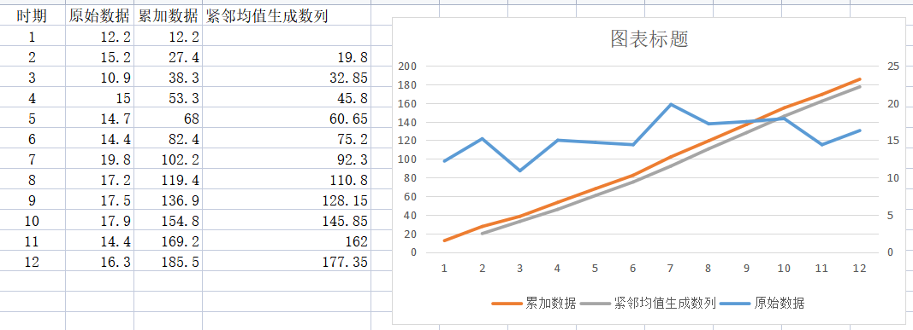
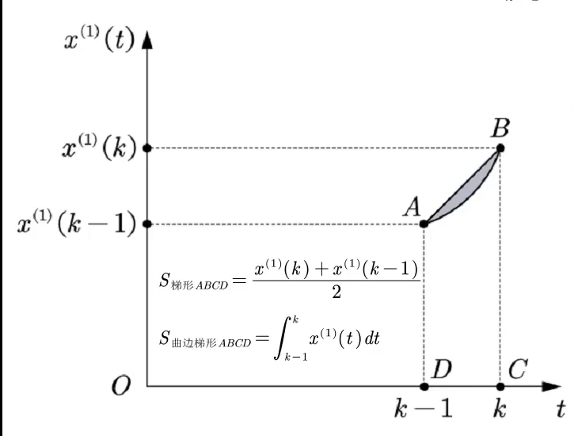
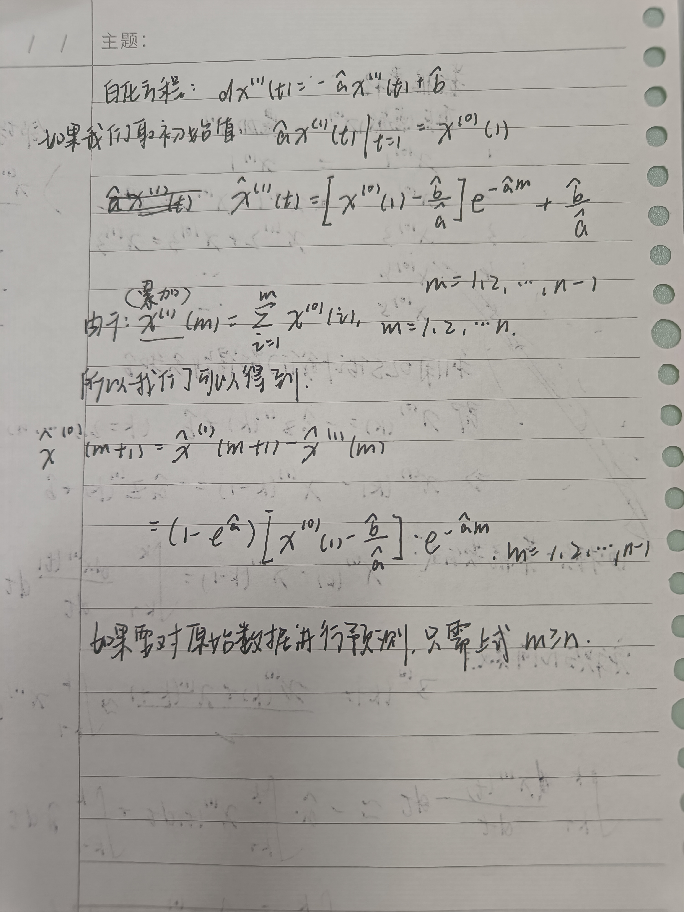
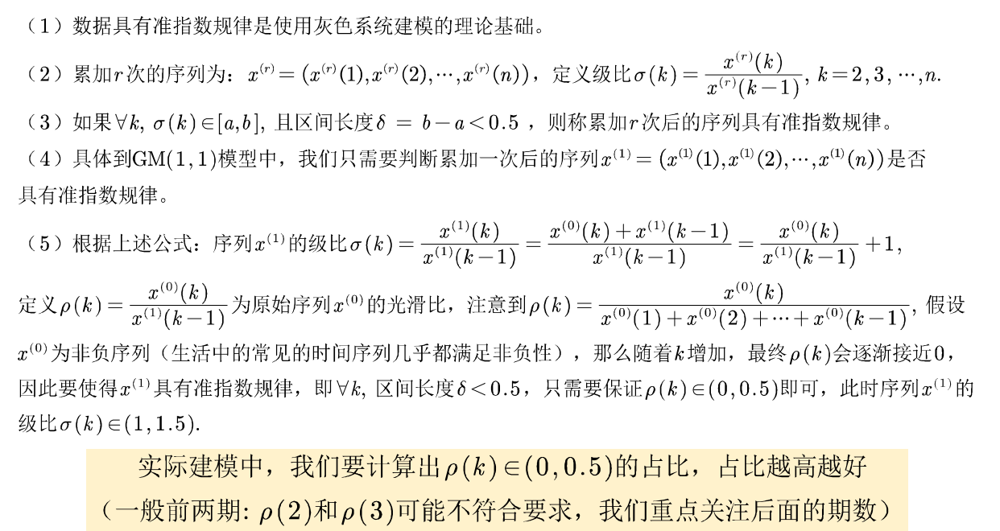

# 一 原理简述
## 1.灰色预测概述
  灰色预测是用灰色模型GM(1,1)来进行定量分析的，通常分为以下几类：
    (1) 灰色==时间序列==预测。用等时距观测到的反映预测对象特征的一系列数量（如产量、销量、人口数量、存款数量、利率等）构造灰色预测模型，预测未来某一时刻的特征量，或者达到某特征量的时间。
    (2) 畸变预测（==灾变预测==）。通过模型预测异常值出现的时刻，预测异常值什么时候出现在特定时区内。
    (3) 波形预测，或称为拓扑预测，它是通过灰色模型预测事物==未来变动的轨迹==。
    (4) 系统预测，对系统行为特征指标建立一族相互关联的灰色预测理论模型，在预测系统整体变化的同时，预测系统各个环节的变化。
  
上述灰色预测方法的共同特点是：
    （1）==允许少数据预测==；
    （2）允许对灰因果律事件进行预测，例如：
     ==灰因白果==律事件：在粮食生产预测中，影响粮食生产的==因子很多==，多到无法枚举，故为灰因，然而粮食==产量却是具体==的，故为白果。粮食预测即为灰因白果律事件预测。
     ==白因灰果==律事件：在开发项目前景预测时，开发项目的投入是具体的，为白因，而项目的效益暂时不很清楚，为灰果。项目前景预测即为灰因白果律事件预测。
    （3）具有可检验性，包括：建模可行性的级比检验（事前检验），建模精度检验（模型检验），预测的滚动检验（预测检验）。

# 2. GM(1,1)模型  ：Grey(Greay) Model

使用原始的==离散非负数据==列，通过一次==累加==生成削弱随机性的较有规律的新的李赛数据列，通过建立微分方程模型，得到在==离散点处的解==，经过==累减==生成的原始数据的==近似估计值==，从而预测原始数据的后续发展。

$ x^0 = (x^0 (1),x^0(2),...,x^0(n))$ 是最初的非负数据列，==累加==得到新的生成数据列 ==$x^1$==
$$x^1 = (x^1 (1),x^1(2),...,x^1(n))$$其中，$x^1(m)=\sum_{i=1}^mx^0(i),m=1,2,...,n  \quad  $

令$z^1$未数列的$x^1$的==紧邻均值生成数列==，即
$$z^1 = (z^1 (2),z^1(3),...,z^1(n))$$
其中$z^1(m)=\delta x^1(m)+(1-\delta)x^1(m-1),m=2,3,...,n $且$\delta=0.5$
>解释来说，$z^1(2)=\frac{x^1(1)+x^1(2)}{2}$




得出偏于更拟合的曲线紧邻边均值生成数列的线段。
我们称方程 ==$x^0(k)+az^1(k)=b$== 为GM(1,1)模型的基本形式(k=2,3,……,n),其中，$b$表示灰作用量，$-a$表示发展系数(==发展系数越小，预测越精确==)


将 ==$x^0$== 视为因变量 ==$y$==,==$z^1$== 序列视为自变量 ==$x$==,进行回归
$x^0(k)=-az^1(k)+b$
$y=kx+b$ ($k=2,3,...,n$)


##原理介绍
###基本过程：
要将灰色微分方程白化，才能将其进行计算


微分方程：$\frac{dx^1(t)}{dt}=-ax^1+b$被成为GM(1,1)模型的白化方程




$z^1(k)=\frac{x^1(k)+x^1(k-1)}{2}\approx\int^k_{k-1}x^1(t)dt$ （定积分的几何含义）

$x^1(k)-x^1(k-1)=\int^k_{k-1}\frac{dx^1(t)}{dt}dt$   （牛顿-莱布尼茨公式）


灰建模的初衷是对数列建立近似的微分方程模型，但是由于==微分方程只适合连续可微函数==，而实践序列数据非连续，更谈不上可微性，因此==灰色预测建模得到的是近似的微分方程==，称之为灰微分方程


GM(1,1)模型的本质是有条件的指数拟合：$f(x)=C_1e^{C_2(x-1)}$, （注意，这里的指数规律主要是针对$x^1(k)$序列而言，原始序列是做差的结果（有点==类似于前缀和相加再做差==）


###白化方程$\frac{dx^1(t)}{dt}=-ax^1+b$的求解



## 准指数规律的检验



##GM(1,1)模型的评价
对未来数据进行预测时，我们要先检验GM(1,1)模型对元数据


```python
# -*- coding: utf-8 -*-
"""
Spyder Editor

This is a temporary script file.
"""
import numpy as np
import math

history_data = [724.57,746.62,778.27,800.8,827.75,871.1,912.37,954.28,995.01,1037.2]
n = len(history_data)
X0 = np.array(history_data)

#累加生成
history_data_agg = [sum(history_data[0:i+1]) for i in range(n)]
X1 = np.array(history_data_agg)

#计算数据矩阵B和数据向量Y
B = np.zeros([n-1,2])
Y = np.zeros([n-1,1])
for i in range(0,n-1):
    B[i][0] = -0.5*(X1[i] + X1[i+1])
    B[i][1] = 1
    Y[i][0] = X0[i+1]

#计算GM(1,1)微分方程的参数a和u
#A = np.zeros([2,1])
A = np.linalg.inv(B.T.dot(B)).dot(B.T).dot(Y)
a = A[0][0]
u = A[1][0]

#建立灰色预测模型
XX0 = np.zeros(n)
XX0[0] = X0[0]
for i in range(1,n):
    XX0[i] = (X0[0] - u/a)*(1-math.exp(a))*math.exp(-a*(i));


#模型精度的后验差检验
e = 0      #求残差平均值
for i in range(0,n):
    e += (X0[i] - XX0[i])
e /= n

#求历史数据平均值
aver = 0;     
for i in range(0,n):
    aver += X0[i]
aver /= n

#求历史数据方差
s12 = 0;     
for i in range(0,n):
    s12 += (X0[i]-aver)**2;
s12 /= n

#求残差方差
s22 = 0;       
for i in range(0,n):
    s22 += ((X0[i] - XX0[i]) - e)**2;
s22 /= n

#求后验差比值
C = s22 / s12   

#求小误差概率
cout = 0
for i in range(0,n):
    if abs((X0[i] - XX0[i]) - e) < 0.6754*math.sqrt(s12):
        cout = cout+1
    else:
        cout = cout
P = cout / n

if (C < 0.35 and P > 0.95):
    #预测精度为一级
    m = 10   #请输入需要预测的年数
    #print('往后m各年负荷为：')
    f = np.zeros(m)
    for i in range(0,m):
        f[i] = (X0[0] - u/a)*(1-math.exp(a))*math.exp(-a*(i+n))    
else:
    print('灰色预测法不适用')```